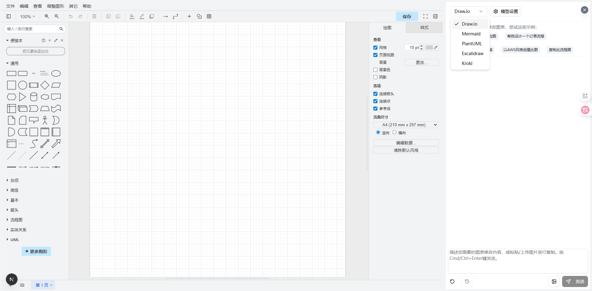
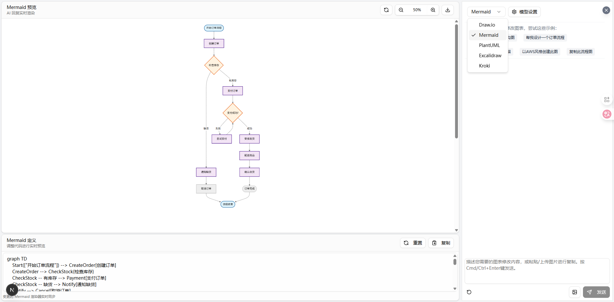
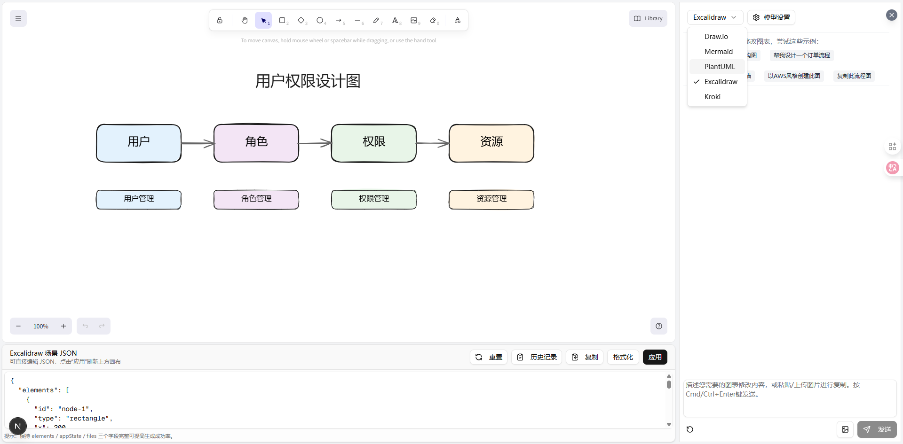
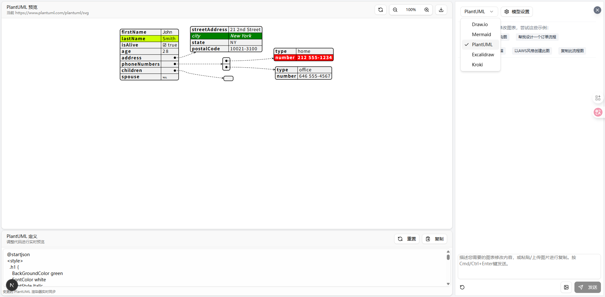
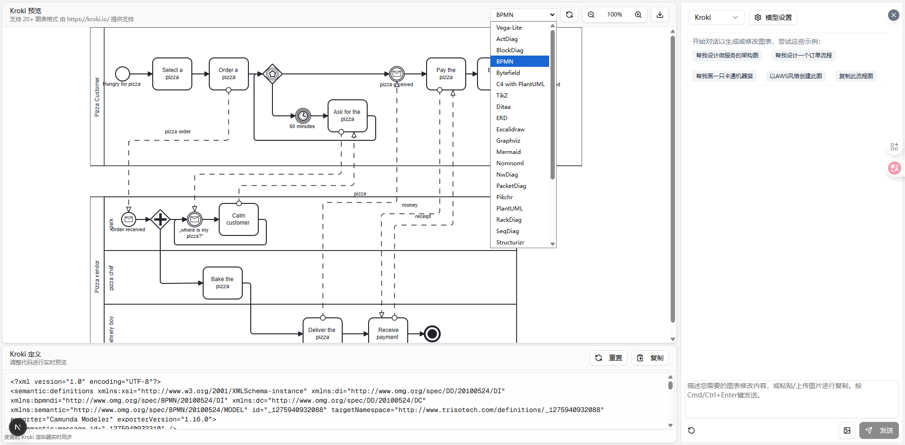

# AI Smart Draw

An intelligent diagramming application built with Next.js that harnesses the power of AI to create and manipulate various types of diagrams including Draw.io (diagrams.net), Mermaid, PlantUML, and Excalidraw through natural language commands.

🔗 **Live Demo**: 






## 🌟 Key Features

- **AI-Powered Diagram Creation**: Transform natural language descriptions into professional diagrams
- **Multi-Format Support**: Work with Draw.io XML, Mermaid, PlantUML, and Excalidraw formats
- **Intelligent Editing**: Modify existing diagrams through conversational AI prompts
- **Real-time Preview**: See changes as you interact with the AI
- **Version History**: Track and restore previous versions of your diagrams
- **Flexible Rendering**: Multiple rendering options with fallback mechanisms
- **Model Configuration**: Customize AI models directly from the browser

## 🎯 Supported Diagram Types

### Draw.io (diagrams.net)
Create and edit professional flowcharts, process diagrams, and complex visualizations using AI-powered XML generation and modification.

### Mermaid
Generate flowcharts, sequence diagrams, Gantt charts, and more with live SVG previews in a dedicated workspace.

### PlantUML
Create UML diagrams with a built-in rendering proxy that supports plantuml.com, kroki.io, or custom endpoints.

### Excalidraw
Freehand-style sketching combined with AI assistance for organic diagram creation.

### Kroki
Generate diagrams in various formats using the kroki.io service with a single interface. Supports over 20 diagram types including:

- **PlantUML**: UML diagrams, activity diagrams, sequence diagrams, etc.
- **Mermaid**: Flowcharts, sequence diagrams, Gantt charts, etc.
- **BPMN**: Business Process Modeling Notation for workflow diagrams
- **Graphviz**: Graph visualization and network diagrams
- **BlockDiag**: Block diagrams
- **C4-PlantUML**: Software architecture diagrams
- **Ditaa**: ASCII art to image conversion
- **Erd**: Entity relationship diagrams
- **Excalidraw**: Hand-drawn like sketches
- **Vega/Vega-Lite**: Data visualizations
- **And 10+ more formats**

## 🛠 How It Works

AI Smart Draw leverages modern web technologies to bridge natural language and diagrammatic representations:

- **Next.js App Router**: Fast, modern React framework with server-side rendering
- **AI SDK Integration**: Seamless communication with OpenAI-compatible APIs
- **Context-Aware Prompts**: Intelligent prompt engineering for each diagram type
- **Real-time Streaming**: Instant feedback with streaming responses
- **Format-Specific Tools**: Dedicated tools for each diagram format (`display_mermaid`, `display_plantuml`, etc.)

The application converts your natural language requests into structured diagram code, which is then rendered in real-time.

## 🚀 Getting Started

### Prerequisites
- Node.js 18+
- npm or yarn

### Installation

1. Clone the repository:


## Features

-   **LLM-Powered Diagram Creation**: Leverage Large Language Models to create and manipulate draw.io diagrams directly through natural language commands
-   **Image-Based Diagram Replication**: Upload existing diagrams or images and have the AI replicate and enhance them automatically
-   **Diagram History**: Comprehensive version control that tracks all changes, allowing you to view and restore previous versions of your diagrams before the AI editing.
-   **Interactive Chat Interface**: Communicate with AI to refine your diagrams in real-time
-   **Smart Editing**: Modify existing diagrams using simple text prompts
-   **Targeted XML Editing**: AI can now make precise edits to specific parts of diagrams without regenerating the entire XML, making updates faster and more efficient
-   **Improved XML Handling**: Automatic formatting of single-line XML for better compatibility and reliability
-   **Mermaid Playground**: A dedicated `/mermaid` workspace that mirrors the Draw.io chat experience while streaming Mermaid previews and definitions
-   **PlantUML Workspace**: Generate PlantUML snippets with live previews rendered via a configurable proxy (defaults to `plantuml.com` with automatic `kroki.io` fallback)
-   **Excalidraw Canvas**: Freehand-style `/excalidraw` workspace that pairs the Excalidraw editor with the same chat-first workflow
-   **Kroki Workspace**: A unified interface for generating diagrams in multiple formats using the kroki.io service

## How It Works

The application uses the following technologies:

-   **Next.js**: For the frontend framework and routing
-   **@ai-sdk/react**: For the chat interface and AI interactions
-   **react-drawio**: For diagram representation and manipulation

Diagrams are represented as XML that can be rendered in draw.io. The AI processes your commands and generates or modifies this XML accordingly. Mermaid and Excalidraw modes reuse the same chat experience while targeting their respective formats.

## Mermaid Workspace

Looking for a lighter-weight syntax-first workflow? Navigate to /mermaid to open a mirrored chat interface that:

-   Streams Mermaid definitions generated by your configured OpenAI-compatible model via the display_mermaid tool
-   Shows a zero-lag SVG preview alongside the raw code
-   Lets you reset, copy, and continue iterating without leaving the same UI paradigm as the Draw.io view

This makes it easy to produce quick flowcharts, sequence diagrams, and architecture sketches when you don't need the full draw.io canvas.
## PlantUML Workspace

Prefer text-based diagrams? Visit `/plantuml` to:

-   Generate PlantUML via the `display_plantuml` tool
-   Preview diagrams through the built-in proxy (tries `plantuml.com`, falls back to `kroki.io`, or any endpoint configured via `PLANTUML_RENDER_BASE`)
-   Reset or copy the snippet from the workspace panel

> **Tip:** If your environment cannot reach the public PlantUML servers, point `PLANTUML_RENDER_BASE` to an internal renderer (for example a self-hosted `plantuml-server` or Kroki instance). The preview UI will surface whichever renderer succeeded.

## Getting Started

### Installation

1. Clone the repository:

```bash
git clone https://github.com/shenpeiheng/ai-smart-draw.git
cd ai-smart-draw
```

2. Install dependencies:

```bash
npm install
# or
yarn install
```

3. Create a `.env.local` file in the root directory. You can use `env.example` as a template:

```bash
cp env.example .env.local
```

Then update `.env.local` with your OpenAI credentials.

### OpenAI Configuration

-   `OPENAI_API_KEY` (required): Secret key from your OpenAI account.
-   `OPENAI_MODEL` (optional): Defaults to `gpt-4o-mini`, override if you prefer another released variant.
-   `OPENAI_BASE_URL` (optional): Defaults to `https://api.openai.com/v1`; set this if you are self-hosting a proxy or gateway.

Example snippet:

```bash
OPENAI_API_KEY="sk-your-key"
# OPENAI_MODEL="gpt-4o-mini"
# OPENAI_BASE_URL="https://api.openai.com/v1"
```

#### Optional: Configure from the browser

-   Click the **模型设置** button in any workspace header to override API Key, Base URL, or model for the current browser. Values are stored in `localStorage` and only sent to the server when you submit a chat request.
-   Leave any field blank to fall back to the server-side environment variables described above.
-   Use the **拉取列表** button to call the `/api/models` helper, which forwards the current credentials to `GET /models` and lists selectable model IDs.

4. Run the development server:

```bash
npm run dev
```

5. Open [http://localhost:3000](http://localhost:3000) in your browser to see the application.
    - `/` -> Draw.io (XML workflows, diagram history, file upload)
    - `/mermaid` -> Mermaid (live preview + definition card powered by your configured OpenAI-compatible model)
    - `/plantuml` -> PlantUML (text-based diagrams with remote preview)
    - `/excalidraw` -> Excalidraw (freeform canvas powered by the same model)
    - `/kroki` -> Kroki (multi-format diagrams powered by kroki.io)

## Deployment

The easiest way to deploy your Next.js app is to use the [Vercel Platform](https://vercel.com/new) from the creators of Next.js.

Check out the [Next.js deployment documentation](https://nextjs.org/docs/app/building-your-application/deploying) for more details.

Or you can deploy by this button.
[](https://vercel.com/new/clone?repository-url=https%3A%2F%2Fgithub.com%2Fshenpeiheng%2Fai-smart-draw)

## Project Structure

```
app/                  # Next.js application routes and pages
  extract_xml.ts      # Utilities for XML processing
components/           # React components
  chat-input.tsx      # User input component for AI interaction
  chatPanel.tsx       # Chat interface with diagram control
  ui/                 # UI components (buttons, cards, etc.)
lib/                  # Utility functions and helpers
  utils.ts            # General utilities including XML conversion
public/               # Static assets including example images
```

## TODOs

-   [x] Allow the LLM to modify the XML instead of generating it from scratch everytime.
-   [x] Improve the smoothness of shape streaming updates.

## License

This project is licensed under the MIT License.

## Star History

[](https://www.star-history.com/#shenpeiheng/ai-smart-draw&type=date&legend=top-left)


